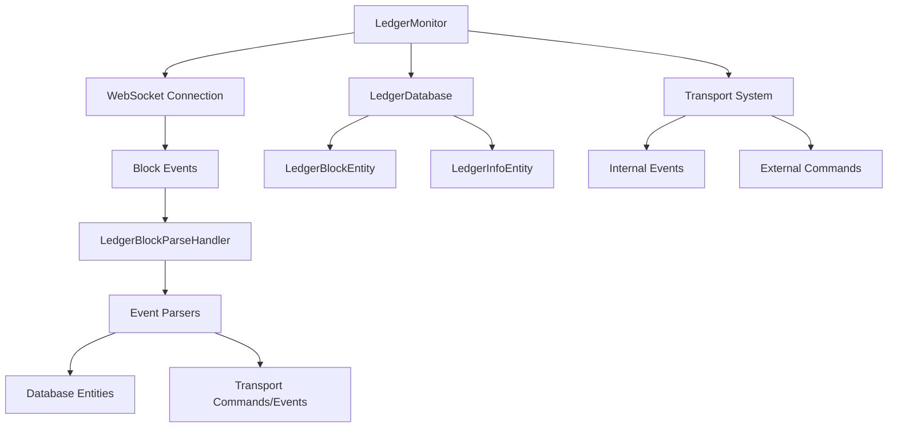

# @hlf-explorer/monitor

[](https://badge.fury.io/js/%40hlf-explorer%2Fmonitor)
[](https://opensource.org/licenses/ISC)

Библиотека для мониторинга и обработки событий блокчейна Hyperledger Fabric. Предоставляет комплексные инструменты для интеграции с блокчейн-системой, мониторинга новых блоков и обработки событий в реальном времени.

## 🚀 Основные возможности

- **Мониторинг блокчейна** - автоматическое отслеживание новых блоков в реальном времени
- **Парсинг событий** - гибкая система обработки событий блокчейна с возможностью расширения
- **Управление данными** - автоматическое сохранение и синхронизация данных блокчейна
- **WebSocket интеграция** - работа через WebSocket соединения для получения событий в реальном времени
- **База данных** - интеграция с TypeORM для хранения метаданных блокчейна
- **Транспортная система** - отправка команд и событий через внутреннюю транспортную систему

## 📦 Установка

```bash
npm install @hlf-explorer/monitor
```

## 🏗️ Архитектура

### Основные компоненты

#### 1. LedgerMonitor
Центральный компонент для мониторинга блокчейна:
- Подключается к блокчейну через WebSocket
- Отслеживает появление новых блоков
- Управляет процессом парсинга блоков
- Синхронизирует состояние с базой данных

#### 2. LedgerDatabase
Слой работы с базой данных:
- Управление сущностями блокчейна (`LedgerBlockEntity`, `LedgerInfoEntity`)
- Отслеживание обработанных и необработанных блоков
- Синхронизация метаданных блокчейна

#### 3. LedgerEventParser
Абстрактный класс для парсинга событий:
- Базовый функционал для обработки событий блокчейна
- Интеграция с транспортной системой
- Расширяемая архитектура для различных типов событий

#### 4. LedgerBlockParseHandler
Обработчик парсинга блоков:
- Управление коллекцией парсеров событий
- Координация процесса парсинга
- Интеграция с базой данных и транспортной системой

### Схема работы



## 🔧 Использование

### Базовое использование

```typescript
import { LedgerMonitor, LedgerDatabase } from '@hlf-explorer/monitor';
import { LedgerApiClient } from '@hlf-explorer/common';
import { Transport } from '@ts-core/common';

// Инициализация компонентов
const api = new LedgerApiClient(apiConfig);
const database = new LedgerDatabase(logger, connection, ledgerName);
const transport = new Transport();

// Создание монитора
const monitor = new LedgerMonitor(logger, transport, database, api);

// Запуск мониторинга
await monitor.start();
```

### Создание кастомного парсера событий

```typescript
import { LedgerEventParser } from '@hlf-explorer/monitor';

class CustomEventParser extends LedgerEventParser<CustomEventData, RequestType, ResponseType> {
    protected async execute(): Promise<void> {
        // Обработка события
        const eventData = this.data;
        const userId = this.userId;
        const request = this.request;
        
        // Создание сущности
        const entity = this.entityAdd({
            // ... данные сущности
        });
        
        // Отправка события
        this.eventAdd({
            type: 'CustomEvent',
            data: eventData
        });
        
        // Отправка команды
        this.commandAdd({
            name: 'CustomCommand',
            request: { /* данные команды */ }
        });
    }
}
```

### Регистрация парсера в обработчике

```typescript
import { LedgerBlockParseHandler } from '@hlf-explorer/monitor';

class CustomBlockParseHandler extends LedgerBlockParseHandler {
    constructor(logger, transport, database, api) {
        super(logger, transport, database, api);
        
        // Регистрация парсеров событий
        this.parserAdd('CustomEvent', CustomEventParser);
        this.parserAdd('AnotherEvent', AnotherEventParser);
    }
    
    protected createParser(type: LedgerEventParserClass): LedgerEventParser<any, any, any> {
        return new type(this.logger, this.api);
    }
}
```

## 📊 Модель данных

### LedgerBlockEntity
Содержит информацию о блоках блокчейна:
- `id` - уникальный идентификатор
- `number` - номер блока
- `date` - дата создания блока

### LedgerInfoEntity
Метаданные блокчейна:
- `name` - имя блокчейна
- `ledgerId` - идентификатор блокчейна
- `blockHeight` - текущая высота блока
- `blockHeightParsed` - высота последнего обработанного блока
- `blockFrequency` - частота проверки новых блоков

## 🔄 Транспортная система

Библиотека использует внутреннюю транспортную систему для:
- Отправки команд между компонентами
- Распространения событий
- Интеграции с внешними системами

### Основные команды и события

- `LedgerBlockParseCommand` - команда для парсинга блока
- `LedgerBlockParsedEvent` - событие о завершении парсинга блока

## ⚙️ Конфигурация

### Настройка монитора

```typescript
const monitor = new LedgerMonitor(logger, transport, database, api);

// Настройка поведения при ошибках
monitor.isExitOnError = true; // Завершение процесса при ошибке

// Запуск мониторинга
await monitor.start();
```

### Настройка базы данных

```typescript
// Создание миграций для сущностей
// 1627121250000-LedgerInfoAddMigration.ts
// 1627121250010-LedgerBlockAddMigration.ts
```

## 🛠️ Разработка

### Сборка проекта

```bash
# Сборка
make build

# Очистка
make clean

# Публикация
make publish
```

### Структура проекта

```
src/
├── controller/           # Обработчики команд
├── database/            # Сущности и миграции БД
├── transport/           # Транспортная система
├── LedgerMonitor.ts     # Основной класс монитора
├── LedgerDatabase.ts    # Слой работы с БД
└── public-api.ts        # Публичный API
```

## 📝 Лицензия

ISC License

## 👨‍💻 Автор

**Renat Gubaev** - [renat.gubaev@gmail.com](mailto:renat.gubaev@gmail.com)

## 🔗 Связанные проекты

- [@hlf-explorer/common](https://github.com/ManhattanDoctor/hlf-explorer-common) - Общие компоненты для работы с Hyperledger Fabric
- [@ts-core/backend](https://github.com/ManhattanDoctor/ts-core-backend) - Бэкенд фреймворк